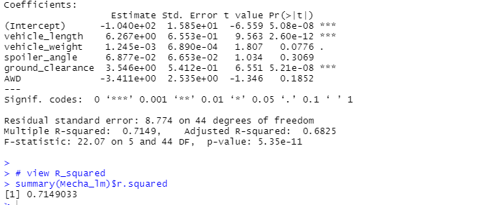
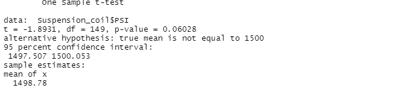
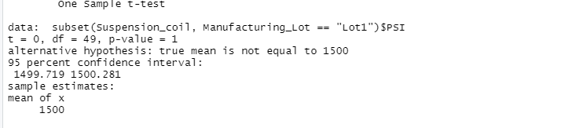
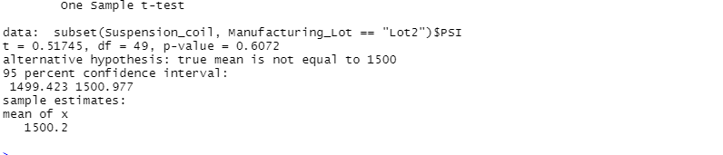
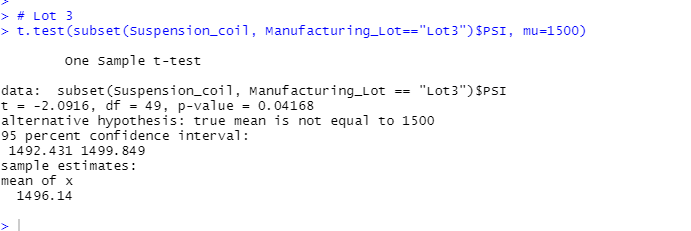

# MechaCar_Statistical_Analysis
 # Demo of R and its statistical test capabilities

## Deliverable 1: Linear Regression to Predict MPG.

    -Q1 which variable/coefficients provided a non-random amount pf variance to the mpg values in the dataset?

    -A1  Vechicel_ length and ground_clearance have a significant impact on mg

-Q2 Is the slope of the linear model considered to be zero? Why or why not?

    -A2 The intercept is statistically significant less that 0.05 and not zero.

-Q3 Does this linear model predict mpg of MechaCar prototypes effectively? Why or why not?

    -A3 Thee Multiple R-swuared value is 0.71 while the p-value remained significant(ver small) indicating that the model does an adequate job of prediciting mpg. 

## Deliverable 2: suspension coil summary statistics..

 #In total the specification are met with variance of 62.29(less than 100)
 
 #By lots, lots 1 & 2 are within specification : whereas  lot 3 has a variance that exceeds specification (100PSI)

## Deliverable 3: 3: T-Tests on Suspension Coils 

#All manufacturing lots: Perform a t.test using PSI and mu of 1500 and evaluate the resulting p-value for significance using a .05 level of signification. 

#lot one is not significantlly different from the poplulation mean(with p-value 1)

#lot two is not is not significantlly different from the poplulation mean(with p-value 0.61)

#lot three however is significantlly different from the poplulation mean(with p-value 0.042)

## Deliverable 4: Design a Study Comparing the MechaCar to the Competition
 #An additional metric (not in Mechcar_mpg dataset) is fuel. what fuel is more likely to be used. 

 #The null hypothesis would be there is no statistical difference whole the Alternative hypothesis would be there is a differencce  